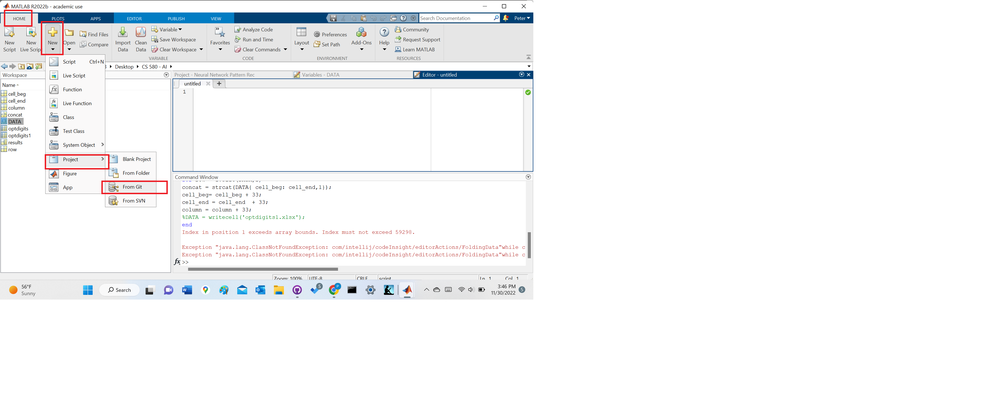

# Assignmenet 5: Neural Network Pattern Recognition

    Peter Mavronicolas
    Old Dominion University
    CS 580, Fall 2022
    Dr. Yaohang Li
    November 28,2022

## Description
Pattern recognition using neural network in Matlab. Optdigits as the data source. See Works Cited

## How to Use
1) In Matlab, select New + > Project > From Git

2) Paste in the following url: https://github.com/winstreak1/neural_network_pattern_recog.git
3) To view optdigits.xlsx, double-click on the filename in the workspace on the left.
3) To run neural network pattern recognition, select Apps > Neural Network Pattern Recognition or 
type 'nnprtool' in the command line.

## Works Cited
* MATLAB. (2020, July 21). How to use source control in Matlab with GitHub. YouTube. Retrieved November 30, 2022, from https://www.youtube.com/watch?v=O7A27uMduo0 
* nanohubtechtalks. (2022, October 12). Data Cleaning with MATLAB. YouTube. Retrieved November 30, 2022, from https://www.youtube.com/watch?v=tfxh5ykuBmI 
* Alligator.io. (2020, October 12). How to add images in Markdown. DigitalOcean. Retrieved November 30, 2022, from https://www.digitalocean.com/community/tutorials/markdown-markdown-images
* Pramoditha, R. (2022, June 13). Using PCA to reduce number of parameters in a neural network by 30X Times. Medium. Retrieved December 1, 2022, from https://towardsdatascience.com/using-pca-to-reduce-number-of-parameters-in-a-neural-network-by-30x-times-fcc737159282
* STR. Remove leading and trailing characters from strings - MATLAB. (n.d.). Retrieved December 1, 2022, from https://www.mathworks.com/help/matlab/ref/strip.html