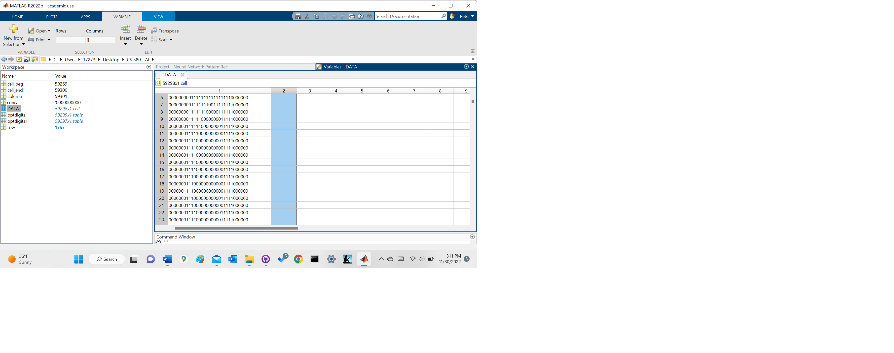
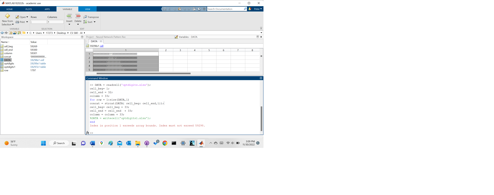
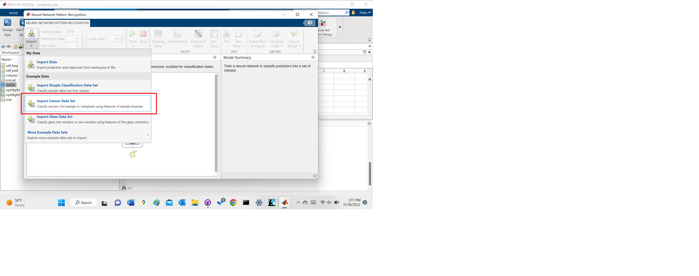
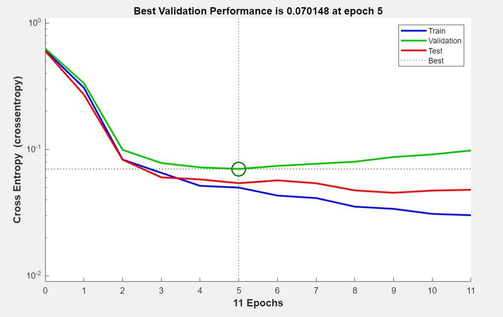
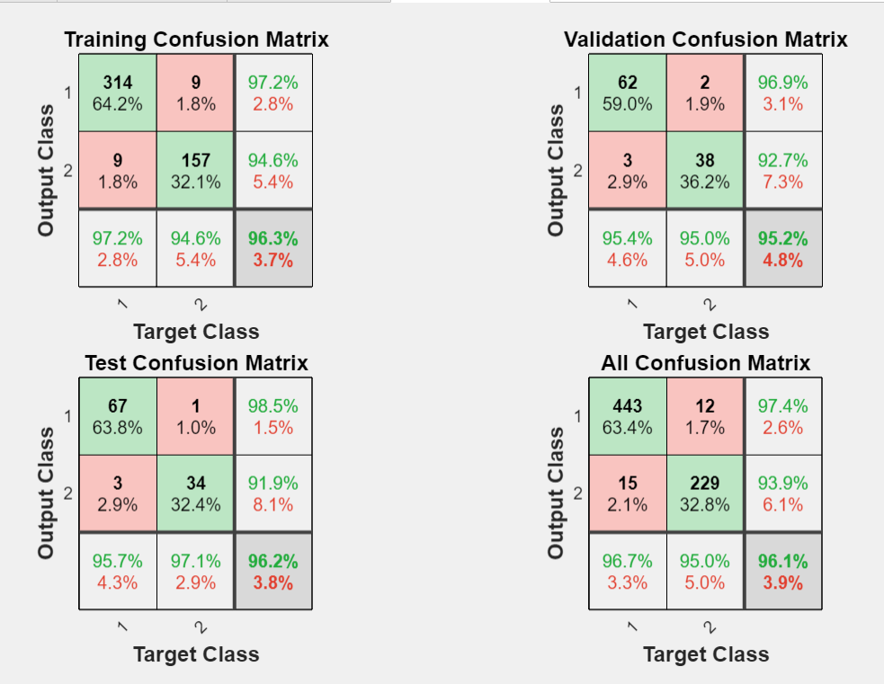
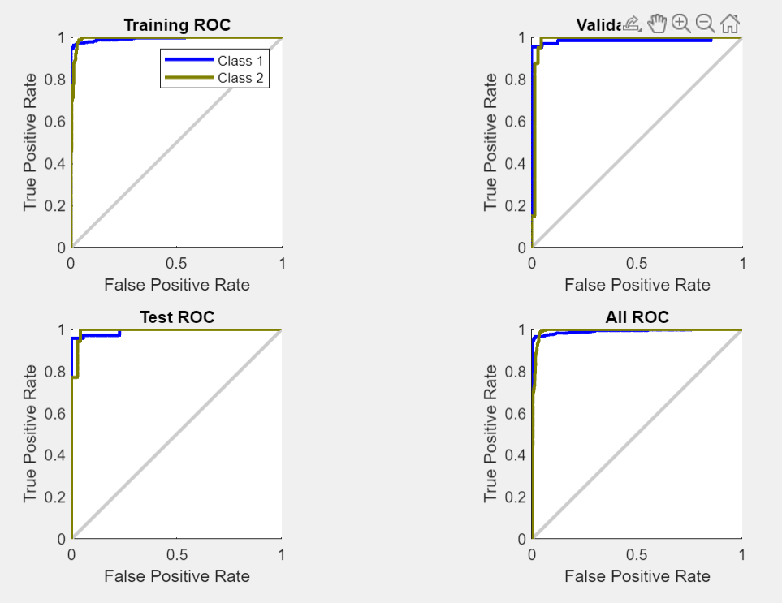

# Assignment 5: Neural Network Pattern Recognition

    Peter Mavronicolas
    Old Dominion University
    CS 580, Fall 2022
    Dr. Yaohang Li
    November 28,2022

## Task 1
### Importing
The data file named "optdigits-orig.windep.Z" was downloaded and unzipped using WinZip. This revealed the filename 
"optdigits-orig.windep". For simplicity's sake, I changed the filename to "optdigits". Next, I 
imported the data into Matlab which revealed (1) column and 59,301+ rows of data. I then copied the data from 
Matlab and pasted it into a new excel file which I named "optdigits.xlsx".


### Data Cleaning
The beginning of the file contained informational rows that were discarded though manual data cleaning. I was now 
left with 59,301 rows. In order to concatenate each set of 32 rows that depicted the number 0-9 in 0's and 1's, I
applied the following command:
```commandline
concat = strcat(DATA{1:32,1});
```
The output successfuly concatenated 32 rows (1-32) of the optdigits.xlsx spreadsheet into one column.

### Looping through the Spreadsheet
Finally, I created a for-loop after watching several YouTube videos that would iterate through the spreadsheet;
copying each iteration to a new file named "optdigitd2.xlsx". I then created a for-loop to iterate throught the spreadsheet. 
```commandline
%input data
DATA = readcell('optdigits.xlsx');
%declare variables
cell_beg = 1;
cell_end = 32;
column = 33;

%loop through spreadsheet and concatenate every 32 rows. Create column header on 33rd row.
for row = 1:size(DATA,1)
    %concatenate ever 32 rows
    concat = strcat(DATA{cell_beg: cell_end, 1});
    
    %update rows to be iterated
    cell_beg = cell_beg + 33;
    cell_end = cell_end + 33;
    column = column + 33;
    end
```

Unfortunately, after several hours of attempting to
create the new spreadsheet, I was constantly given the command line error which read the following:
```commandline
Index in position 1 exceeds array bounds. Index must not exceed 59298.
```


If time permits, I plan to re-visit this code and correct my errors.

## Task 2: Option 2
### Train
To begin, be sure to include Matlab's Neural Network during installation. An alternative which is 
used in older version of Matlab is type to the following command:
```commandline
nnprtool
```
Once the neural network pattern recognition tool is opened, I imported the Cancer data set provided
by Matlab. I left the default setting of Training Data 70%, Validation Data 15%, Test Data 15%. The
layer size was increased to 20 as demonstrated in class.



### Results and Analysis


In the image above, we view four lines on the curve. Blue is 'Train', green is 'Validation' and red is 
'Test'. The model was directly built using the 'Train' data set. 'Validation' is used to find the 
optimal machine learning model. At the beginning of training, cross-entropy specifies how well the
training is. As the training set continues to decrease cross-entropy, it approaches optimal value
where the number of epochs no longer decreases. this point is where training should be stopped. Beyond 
this low, over-fitting occurs. After this point, the model performs poorly. The point where over-fitting 
is detected is where 'Train' and 'Validation' lines diverge and crossover. Beyond the divergence, 'Train' 
set errors will decrease and 'Validation' set errors increase.



The confusion matrix above shows how well the model is performing. 70% of the data is used to build the 
training model. In the training confusion matrix at top left, you'll notice the coljmns are the target 
classes and the rows are the output classes. In the top left of the target matrix, 314 cases belong to 
class 1. This represents the true positive value. This value shows a correct prediction that sets in class 
1 are indeed class 1. To the right of true positive, the value 9 represents the false positive (Type I Error)
where the model incorrectly predicted the value of 1. Below the false positive value of 9 is the value 157 
which represents the true negative value. This means 159 sets were correctly predicted to belong to class 2. 
Finally, the value 9 in column 1, row 2 is the false negative (Type II Error). It is a misprediction that the 
set belongs to class 2 when it really belongs to class 1. The value 97.2 in the third column, first row is the 
positive predictive value (PPV). This is the percentage of true positive values. Below PPPV is the False 
omission rate of 94.6%. This represents the percentage of true negative values. In the first column, third row
we have the sensitivity or recall value of 97.2%. Sensitivity represents the true positive rate which you'll 
notice equals the positive predicitve value. In the second column, third row, the fall-out or false positive 
rate is the same value as the false omission rate. LAstly, the third row, third column shows the accuracy of 
the model. This value is the total true positive value plus the total true negative values divided by the total
population size. 

The accuracy value to be reported should be the accuracy of the test confusion matrix since it
includes information your not specifically testing for. The validation confusion matrix gives you an idea of where
to stop the training and the test confusion matrix reflects the size of the validation confusion matrix. The true
performance of the model is shown in the test confusion matrix by reporting the precision, recall and accuracy. It is 
also important to note the test set should only be used once rather than repeating the training in order to arrive at
the desired outcome.



## Works Cited
* MATLAB. (2020, July 21). How to use source control in Matlab with GitHub. YouTube. Retrieved November 30, 2022, from https://www.youtube.com/watch?v=O7A27uMduo0 
* nanohubtechtalks. (2022, October 12). Data Cleaning with MATLAB. YouTube. Retrieved November 30, 2022, from https://www.youtube.com/watch?v=tfxh5ykuBmI 
* Alligator.io. (2020, October 12). How to add images in Markdown. DigitalOcean. Retrieved November 30, 2022, from https://www.digitalocean.com/community/tutorials/markdown-markdown-images 